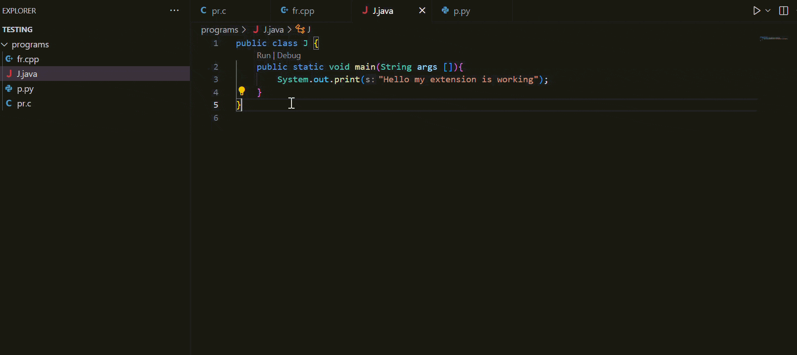

<div align="center">


# Fast Run Tasks

&nbsp;
&nbsp;
&nbsp;
&nbsp;

</div>

> Instantly run Python, Java, C, and C++ with one keypress — zero config, clean output, smart Java package detection.

## Features

- 🚀 **Zero Configuration** - Install and start running code immediately, no setup required
- 🧹 **Clean Output** - No terminal clutter, just your program's actual output
- 🎯 **Smart Java Handling** - Automatically detects `package` declarations and handles classpath correctly
- ⚡ **One-Key Execution** - Single shortcut (`Shift + \``) runs your file instantly
- 🔄 **Fresh Compilation** - Always recompiles before running to avoid stale output
- 🖥️ **Cross-Shell Support** - Works seamlessly with both PowerShell and CMD
  
## Demo


## Why Fast Run? 🎯

Stop wasting time typing compilation commands. Just press **Shift + `** and watch your code run with clean, distraction-free output.

- ✅ Works right after installation — no config files needed
- ✅ No command clutter, just your program's output
- ✅ Automatically detects Java packages from source code
- ✅ Compatible with PowerShell and CMD out of the box
- ✅ Recompiles every run (no stale/cached output)

## Quick Start 🚀

1. **Install the extension**
2. Open any Python, Java, C, or C++ file
3. Press **Shift + `** (Shift + Backtick)
4. Done! Your code runs instantly

## Supported Languages 📋

| Language | Command | Auto-Compile |
|----------|---------|:---:|
| **Python** | `python file.py` | — |
| **Java** | `javac` + `java` | ✅ |
| **C** | `gcc` + run | ✅ |
| **C++** | `g++` + run | ✅ |

## Smart Java Compilation 💡

Automatically detects if your file has a `package` declaration and adjusts execution accordingly. No more "wrong name" errors!

```java
// Simple file (no package) - Works!
class MyClass { }

// Package structure - Also works!
package com.example;
class MyClass { }
```

### Clean Output

Unlike other extensions, Fast Run gives you **only what matters**:

- ❌ No "Running [file]..." messages
- ❌ No path spam in terminal
- ✅ Just your code's output

### Compilation Errors?

If your code has errors, it **won't run** — you'll see the error immediately instead of a confusing crash.

## Settings ⚙️

Customize how Fast Run behaves via VS Code Settings (`Ctrl + ,`) — search for **Fast Run** — or add directly to your `settings.json`:

```json
{
  "fastRun.clearTerminal": true,
  "fastRun.focusTerminal": true
}
```

<!-- configs -->

| Key | Description | Type | Default |
|---|---|---|---|
| `fastRun.clearTerminal` | Automatically clears the terminal before every new run, keeping your workspace clean. Set to `false` to preserve terminal history and compare outputs. | `boolean` | `true` |
| `fastRun.focusTerminal` | Automatically focuses the terminal when you run code — useful for programs needing input (`input()`, `scanf`). Set to `false` to keep cursor in the editor. | `boolean` | `true` |

<!-- configs -->

## Keyboard Shortcuts 🎮

<!-- commands -->

| Shortcut | Action | Supported Extensions |
|---|---|---|
| `Shift + \`` | Run current file | `.py`, `.java`, `.c`, `.cpp` |

<!-- commands -->

*This shortcut works automatically the moment you open a supported file — no setup required.*

## Requirements 📦

Make sure the following are installed **and added to your system PATH**:

- **Python**: `python` command
- **Java**: `javac` and `java` (JDK)
- **C/C++**: `gcc` / `g++` compiler (MinGW on Windows)

To verify PATH setup, open a terminal and run:

```
python --version
javac -version
gcc --version
```

## Troubleshooting 🐛

**"Command not found"?**
- Verify the compiler is installed
- Check it's in your system PATH
- Restart VS Code after installing

**Java package errors?**
- The extension auto-detects packages directly from your code
- Make sure your `package` declaration is correct

**Terminal not clearing?**
- Change setting: `"fastRun.clearTerminal": false`

## Perfect For 🎓

- 👨‍🎓 **Students** learning programming
- 🏃 **Competitive programmers** practicing problems
- 🧪 **Developers** testing quick code snippets
- 👩‍🏫 **Teachers** demonstrating code in class

## Contact to Author 📧

- GitHub: [@zaydmalek](https://github.com/zaydmalek)

## Contributing 🤝

Found a bug? Want a feature? Open an [issue](https://github.com/zaydmalek/Fast-Run-Tasks/issues)!

## License 📝

[MIT](LICENSE) — Free to use, modify, and distribute.

---

<div align="center">

*Stop configuring. Start coding.* ⚡

</div>
